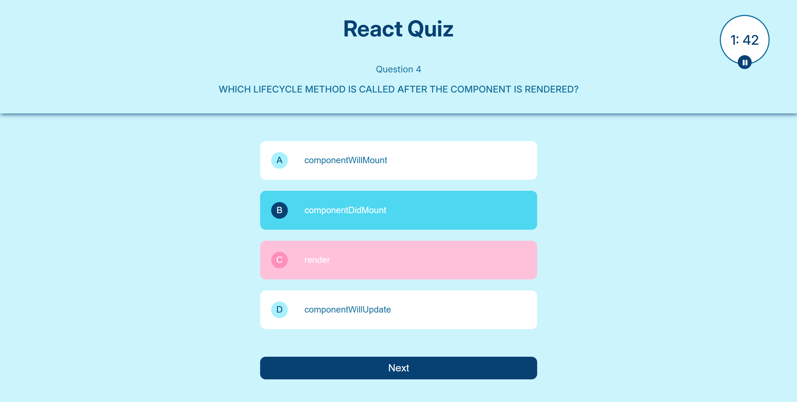
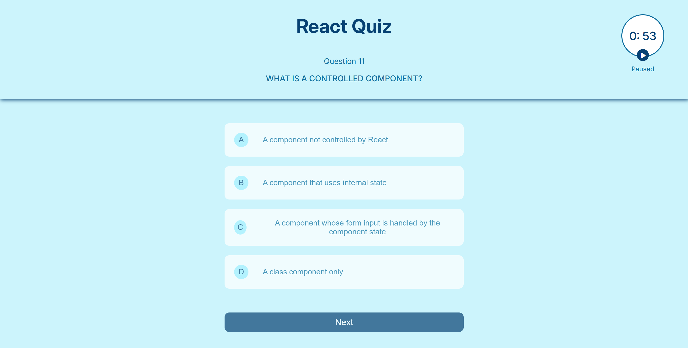
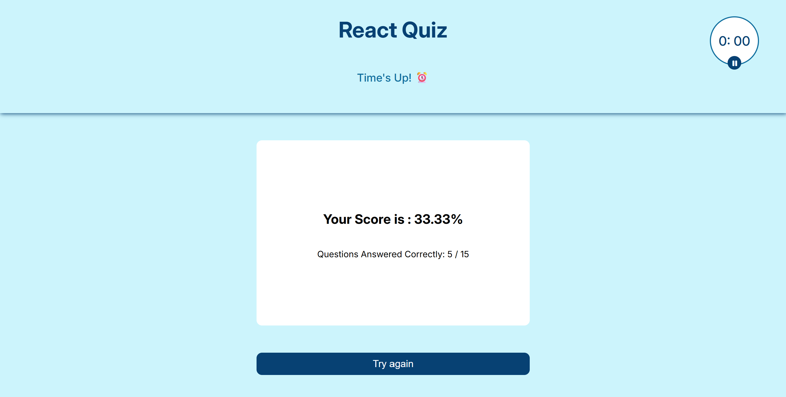

# React Quiz App ⏱️📝
A fast-paced, interactive multiple-choice quiz game built with React. This app challenges users with randomized questions and tracks their performance within a strict 2-minute countdown.

## 🤖 Features

- **2-Minute Countdown Timer**
  - Begins automatically when the page loads.
  - Built using `useState` and `useEffect` hooks.
  - Includes Play/Pause functionality.
  - When paused, all answer options and the **Next Question** button are disabled.

- **Multiple Choice Questions**
  - Each question has 4 options.
  - Selecting:
    - ✅ Correct answer: option background turns **blue**.
    - ❌ Wrong answer: option background turns **red**.
  - Only the **first correct attempt** scores a point.
  - Questions are randomly selected from a pool with **no repetitions**.

- **End of Quiz**
  - When the 2-minute timer ends, your **final score** is displayed.
  - A **"Try Again"** button appears, allowing the user to restart the quiz from the beginning.


## 🛠️ Technologies Used

- **Vite**: Lightning-fast development environment and build tool for modern web apps.
- **React.js**: Handles component-based UI architecture and state management using hooks.
- **JavaScript (ES6+)**: Implements quiz logic, timer functionality, event handling, and dynamic updates.
- **CSS3**: Styles the UI including buttons, color feedback on answers, and responsive design.

## 📸 Preview





## 📽️ Demo
Check out the live demo of the React Quiz App [here](https://the1fatkid.github.io/react-quiz/).

## 🚀 Getting Started
To set up the project locally for development and testing, follow these steps:

1. **Clone the Repository**:
    ```bash
    git clone https://github.com/the1fatkid/react-quiz.git
    ```

2. **Navigate to the Project Directory**:
    ```bash
    cd react-quiz
    ```

3. **Install Dependencies**:
    ```bash
    npm install
    ```

4. **Start the Development Server**:
    ```bash
    npm run dev
    ```

5. **Open the App**:
   Visit `http://localhost:5173` (or the URL specified by Vite) in your browser to interact with the app.

<br><br>

*Thanks for checking out my React Quiz App! Have fun playing! 😄*   


